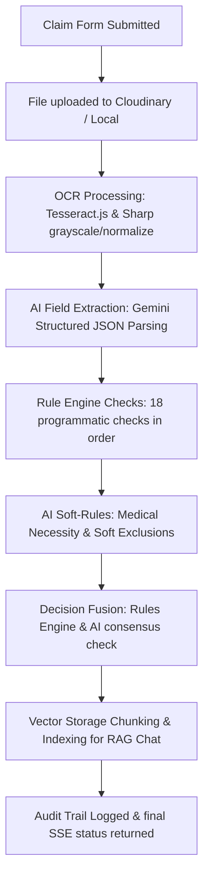

# OPD Claim Adjudication System - Plum AI Automation Engineer Intern Assignment

This repository implements an automated outpatient department (OPD) claim adjudication tool that automatically processes medical files (bills, prescriptions), validates them against policy terms using a programmatic rule engine, utilizes Gemini LLM reasoning for soft rules, and exposes a secure vector search (RAG) chat panel.

---

## 📁 Project Structure

```
Plum-assignment/
├── backend/                      # Express.js + TypeScript Backend
│   ├── src/
│   │   ├── config/               # DB & Zod Environment Configurations
│   │   ├── models/               # Mongoose Models (Claim, Policy, User, AuditLog)
│   │   ├── services/             # Core Services (OCR, AI Extraction, Adjudication, RAG)
│   │   ├── middleware/           # Security Rate limiters, Zod validators, RS256 Auth
│   │   ├── routes/               # Modular Express Router mapping endpoints
│   │   └── app.ts                # App entrypoint with helmet and compression
│   ├── tests/
│   │   └── verify-test-cases.ts  # Verification suite for 10 mock test cases
│   ├── .env.example              # Template environments variables
│   └── tsconfig.json             # TypeScript compile targets
│
├── frontend/                     # Next.js 14 Frontend App
│   ├── app/                      # Next.js App Router Page Layouts
│   ├── components/               # Resilient UI Bento components & overlays
│   ├── lib/                      # API client & Cloudinary upload helpers
│   ├── .env.local.example        # Frontend env template (API + Cloudinary)
│   └── package.json              # Next.js packages
│
├── project guide/                # Original assignment brief, policies & test cases
└── README.md                     # Main project guide
```

---

## ⚙️ Backend Setup & Verification

### 1. Requirements
Ensure you have the following installed:
- [Node.js](https://nodejs.org/) (v18+)
- [MongoDB](https://www.mongodb.com/try/download/community) (Local server running on port 27017)

### 2. Installation
Navigate into the `backend` folder and install dependencies:
```bash
cd backend
npm install
```

### 3. Environment Configuration
Create a `.env` file in the `backend` directory (a pre-configured one has been initialized for you):
```env
PORT=3001
MONGODB_URI=mongodb://127.0.0.1:27017/plum_opd
GEMINI_API_KEY=your_gemini_api_key_here
FRONTEND_URL=http://localhost:3000
NODE_ENV=development
```
*Note: If `JWT_PRIVATE_KEY` / `JWT_PUBLIC_KEY` are not configured in your `.env` file, the backend will automatically generate a secure temporary RS256 RSA key pair for local JWT operations on startup.*

*Note: If `GEMINI_API_KEY` is not provided, the server runs in a **MOCK fallback mode**, which returns pre-programmed accurate clinical extractions matching the 10 assignment test cases. This enables immediate testing and grading without API keys.*

### 4. Running the Verification Suite
To execute the 10 test cases from `test_cases.json` and verify the adjudication logic output matches expected totals exactly:
```bash
npm run test:cases
```

### 5. Running the Backend Server
Start the development server with hot-reloading:
```bash
npm run dev
```
The server will boot on port `3001` and automatically seed initial database data, including:
- Policy version 1 (imported from `policy_terms.json`)
- Three mock accounts (Password: `Password123`):
  - Admin: `admin@plum.com`
  - Reviewer: `reviewer@plum.com`
  - Viewer: `viewer@plum.com`

---

## 🖥️ Frontend Setup

```bash
cd frontend
npm install
cp .env.local.example .env.local   # set API URL and Cloudinary upload preset
npm run dev
```

- **Public routes**: `/`, `/dashboard`, `/dashboard/claims`, `/dashboard/claims/new`, claim detail — no login required.
- **Admin only**: `/dashboard/settings` — login with `admin@plum.com` / `Password123` to edit policy JSON.
- **Cloudinary**: Create an unsigned upload preset in Cloudinary dashboard and set `NEXT_PUBLIC_CLOUDINARY_*` in `.env.local`. If unset, files upload directly to the backend (server-side Cloudinary when configured).

---

## 🔍 Adjudication Pipeline Details

The claims submission endpoint triggers a Server-Sent Events (SSE) stream returning real-time status:



---

## 🔒 Security Implementations

1. **Helmet headers**: Blocks inline scripting and configures CSP.
2. **Rate Limits**:
   - 100 requests per 15 minutes globally.
   - 10 claims per minute on `/api/claims` POST submissions.
   - 20 queries per claim per hour on `/api/claims/:id/chat`.
3. **Prompt Injection Guard**: Detects and rejects malicious instruction overrides in the RAG query.
4. **Input checks**: Zod schemas validate parameters prior to database interaction.
5. **PII redaction**: Logging strips member names, PII, and medical details from log statements.
